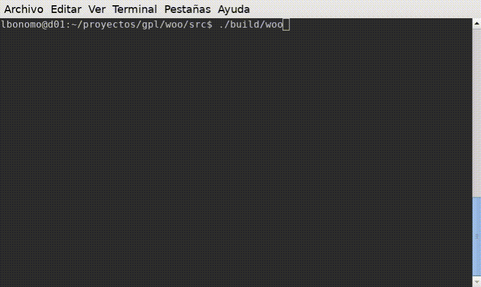

## Binaries

If you like to download the binary version, use this links

 - [Window x86-64](https://github.com/lbonomo/woo/releases/download/v0.0.3/woo.exe)
 - [Linux x86-64](https://github.com/lbonomo/woo/releases/download/v0.0.3/woo)

## Config
The config file is a json format similar this:

```json
{
  "version": 1,
  "woocommerce": {
    "url": "http://woocommerce.lndo.site/" ,
    "consumerKey": "ck_a6849f91fc021160c8fde2dadc9aa91aa733f46d",
    "consumerSecret": "cs_29abba0e6335270b904328494d908efa2937479b",
    "wpAPI": true,
    "version": "wc/v3"
  },
  "source": {
    "filename": "example.xlsx"
  }
}
```
You can download an example at this [link](https://github.com/lbonomo/woo/blob/master/config.json.example?raw=true)

## Input
The input file is a Excel format 2007-365 file. You can download a example at this [link](https://github.com/lbonomo/woo/blob/master/example.xlsx?raw=true)

## Runing
<!-- ffmpeg -i woo-2020-08-31_10.59.23.mp4 woo-2020-08-31_10.59.23.gif -->

